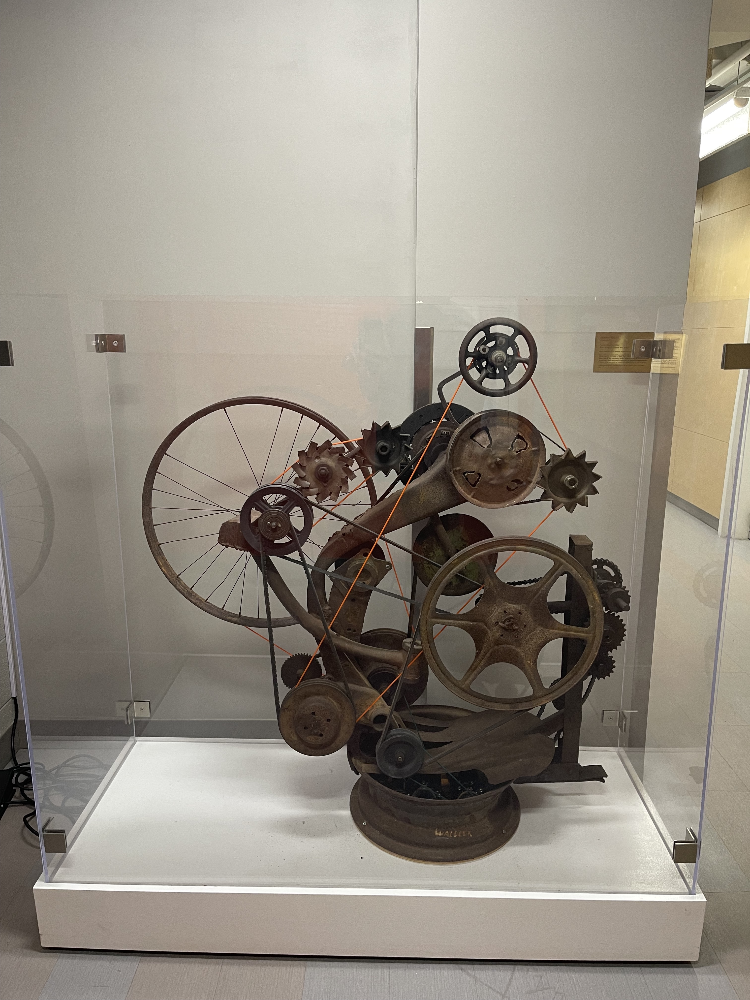
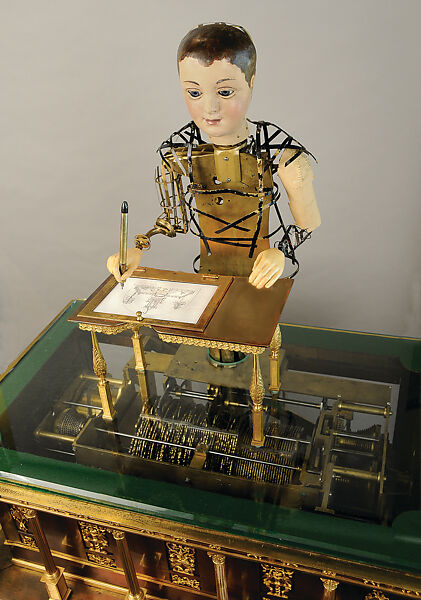
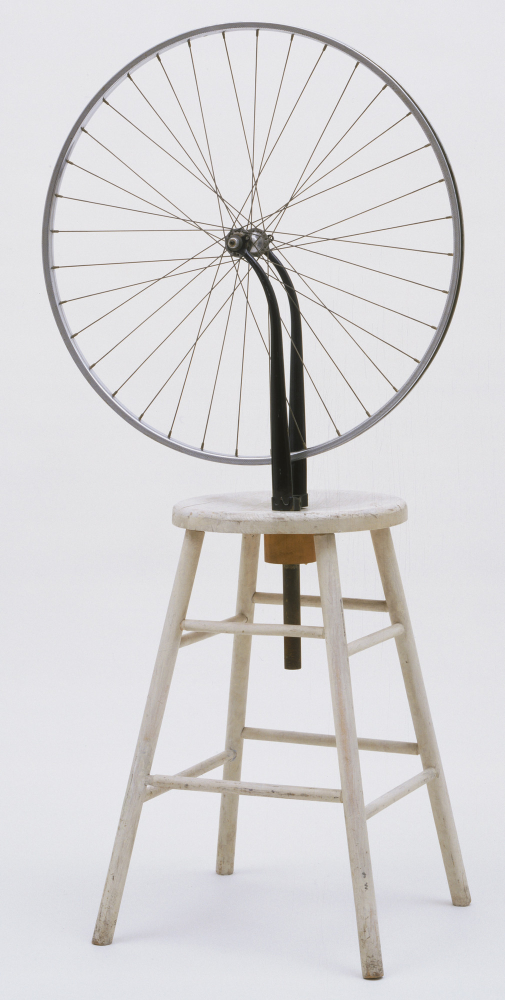
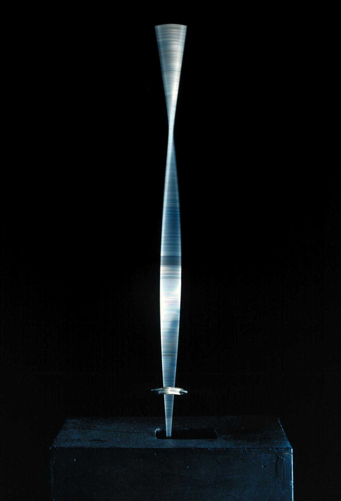
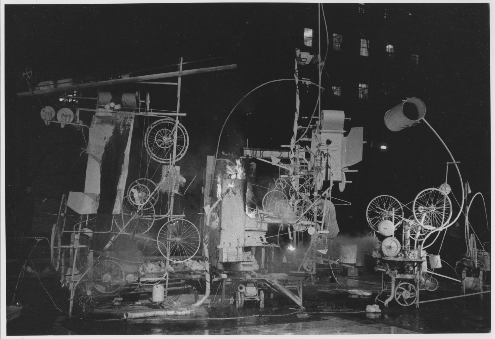

## Week 3 - Brief History of Kinetic Art
<!-- .slide: class=".uk-width-1-1 uk-height-large" -->  

Note:

---

#### <a href="https://drive.google.com/file/d/1AuHEXHhIoLFASmhUh8Diz5SjFDADjwVl/view">The Kinetic Lab</a>

Steve Waldeck

</img>

Note:
The Electronics and Kinetics area was established in 1969.
Static sculptural forms have taken on new dimensions with unconventional treatments.

---

#### <a href="https://en.wikipedia.org/wiki/Antikythera_mechanism">Antikythera mechanism</a>

</img>

Note:
2nd century BC
This is described as the oldest known example of an analogue computer. It was used to predict astronomical positions and eclipses decades in advance.

An **analog signal** is any continuous-time signal representing some other quantity, i.e., analogous to another quantity. For example, in an analog audio signal, the instantaneous signal voltage varies continuously with the pressure of the sound waves.[1]

In contrast, a digital signal represents the original time-varying quantity as a sampled sequence of quantized values. Digital sampling imposes some bandwidth and dynamic range constraints on the representation and adds quantization error.[2]

The term analog signal usually refers to electrical signals; however, mechanical, pneumatic, hydraulic, and other systems may also convey or be considered analog signals. 

---

#### Mechanism

A mechanism is an assembly of moving parts.

In engineering, a mechanism is a device that transforms **input** forces and movement into a desired set of **output** forces and movement.

Note:
1540s, "structure of any kind," from Middle French machine "device, contrivance," from Latin machina "machine, engine, military machine; device, trick; instrument" (source also of Spanish maquina, Italian macchina), from Greek makhana, Doric variant of Attic mēkhanē "device, tool, machine;" also "contrivance, cunning," traditionally (Watkins) from PIE magh-ana- "that which enables," from root magh- "to be able, have power." But Beekes, on formal grounds, objects to the connection to words in Germanic and Slavic. He finds the Greek word isolated and is convinced that it is Pre-Greek.

Main modern sense of "device made of moving parts for applying mechanical power" (1670s) probably grew out of mid-17c. senses of "apparatus, appliance" and "military siege-tower."  It gradually came to be applied to an apparatus that works without the strength or skill of the workman.

---

#### Machine

A machine is any device that helps you do work, from a hammer to a bicycle. A hammer is a machine because it makes your arm longer, so you can do more work.

---

#### Four uses of Machines

- Transform energy
- Transfer energy
- Multiply and/or change direction of force
- Multiply speed

---

#### <a href="https://en.wikipedia.org/wiki/Orrery" width="500">Orrery</a>

</img>

Note:
Planetarium, a mechanical model of the solar system, or of just the sun, earth, and moon, used to represent their relative positions and motions. First ones like the modern era were built in 1704 by clockmakers. The name of the instrument came from Charles Boyle, 4th Earl of Orrery, who commissioned one of the earliest models.

Orreries became very popular at this time and were used both for teaching purposes and, for those who could afford them, recreation in the home.

---

#### Automata

The word automata (the plural of automaton) derives from the Greek word, which means acting of one's own will.

<h5>The Draughtsman-Writer (ca. 1800)</h5>
<h6>Henri Maillardet</h6>

</img>

---

#### The Origins of Animation

<iframe width="560" height="315" src="https://www.youtube.com/embed/fNxUXajnbnY?si=EXIYtzWdVwFpqL05" title="YouTube video player" frameborder="0" allow="accelerometer; autoplay; clipboard-write; encrypted-media; gyroscope; picture-in-picture; web-share" allowfullscreen></iframe>

---

#### <a target="_blank" href="https://www.moma.org/collection/works/81631">Marcel Duchamp</a>

<h5>Bicycle Wheel (1913)</h5>

</img>

Note:
When activated by the press of a button, the machine springs to life: through the rapid oscillations caused by a hidden electric motor in the base, it forms the illusion of a sinuously twisting, three-dimensional shape. The image generated through these movements, with its quivering transparency, is that of a ‘standing wave’: a term taken from the field of physics, familiar to Gabo through his studies in natural science and engineering.

---

#### <a target="_blank" href="https://www.tate.org.uk/art/artworks/gabo-kinetic-construction-standing-wave-t00827">Naum Gabo</a>

<h5>Kinetic Construction (1919-1920)</h5>

</img>

Note:
When activated by the press of a button, the machine springs to life: through the rapid oscillations caused by a hidden electric motor in the base, it forms the illusion of a sinuously twisting, three-dimensional shape. The image generated through these movements, with its quivering transparency, is that of a ‘standing wave’: a term taken from the field of physics, familiar to Gabo through his studies in natural science and engineering.
https://www.youtube.com/watch?v=De1J2V0Cta4

---

#### Alexander Calder

<iframe width="560" height="315" src="https://www.youtube.com/embed/t6jwnu8Izy0?si=4WFGPgqoBiBdxBOT" title="YouTube video player" frameborder="0" allow="accelerometer; autoplay; clipboard-write; encrypted-media; gyroscope; picture-in-picture; web-share" allowfullscreen></iframe>

Note: 
Kinetic art derives from the Greek word “kinesis”, meaning “movement”.

The 1920’s through to the 1960s saw experiments with mobiles

As Calder put it, kinetic art was striving to “lift the figures and scenery off the page and prove undeniably that art is not rigid”. 

Kinetic artists utilised mechanical or natural motion to bring about a new relationship between art and technology, inspired heavily by the “Dada” art movement, breaking with conventions of traditional static artwork.

---

#### Calder's Mobiles

<iframe width="560" height="315" src="https://www.youtube.com/embed/wrrMbrZloYc?si=AD_hkmq7IJmcbGk8" title="YouTube video player" frameborder="0" allow="accelerometer; autoplay; clipboard-write; encrypted-media; gyroscope; picture-in-picture; web-share" allowfullscreen></iframe>

---

#### Laszlo Moholy-Nagy

<iframe width="560" height="315" src="https://www.youtube.com/embed/QHdK19meZTk?si=josk_f9JqIXfsnT7" title="YouTube video player" frameborder="0" allow="accelerometer; autoplay; clipboard-write; encrypted-media; gyroscope; picture-in-picture; web-share" allowfullscreen></iframe>

---

#### Thomas Wilfred

<h5>Clavilux (1925)</h5>

<iframe width="560" height="315" src="https://www.youtube.com/embed/gbs3NQ2mf4c?si=7a_JrIKsseMrD2xj" title="YouTube video player" frameborder="0" allow="accelerometer; autoplay; clipboard-write; encrypted-media; gyroscope; picture-in-picture; web-share" allowfullscreen></iframe>

---

#### <a target="_blank" href="https://vimeo.com/225531185">Jean Tinguely</a>

</img>

Note:
Jean Tinguely first began creating assemblages composed of found-objects, but soon thereafter, intrigued by the current debate regarding the effect of mechanization and industrial innovation on modern society, he completely altered these static works by putting them into motion.

---

#### Metamatics

Tinguely used the term "Metamechanics" to describe how he set his assemblage sculptures into motion with some form of motor or system of mechanics.

http://radicalart.info/process/vibration/metamatic/index.html

Note:
They were robotlike contraptions constructed of wire and sheet metal, moving at varying speeds.
Painting machines.
Self-produced sounds.
Obsessed with the concept of destruction as a means of achieving the "dematerialization" of his works of art.

---

#### <a target="_blank" href="https://vimeo.com/218619751">Tinguely on Destruction</a>

<a href="https://vimeo.com/8537769"></img></a>

Note:
The resulting assemblage was built to slowly self-destruct before an invited audience, and it did just that in the garden of The Museum of Modern art on a Thursday evening in March. Delay timers were used to control the 15 motors that powered its various parts at intervals, as the artist began to dismantle other parts to assist in its self-destruction.

the essence of both life and art consists of continuous change, movement, and instability,

New realism sought to dissolve the distinction between art and the everyday world and often sought to create work out of the detritus of everyday life: fragments of movie posters, garbage, and for Tinguely, an enameled bathtub.

---

#### Sketching a Mechanism Idea

<embed type="text/html" src="https://www.are.na/yeseul-song/motor-mechanism-with-cardboard" width="100%" height="500px">

Note:
You can protect projects from costly overdesign with a basic knowledge of mechanics and materials.
