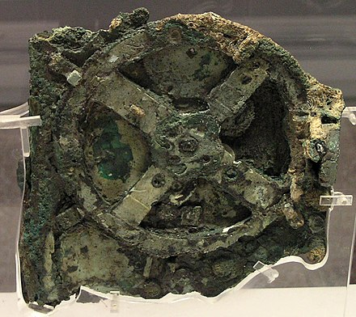
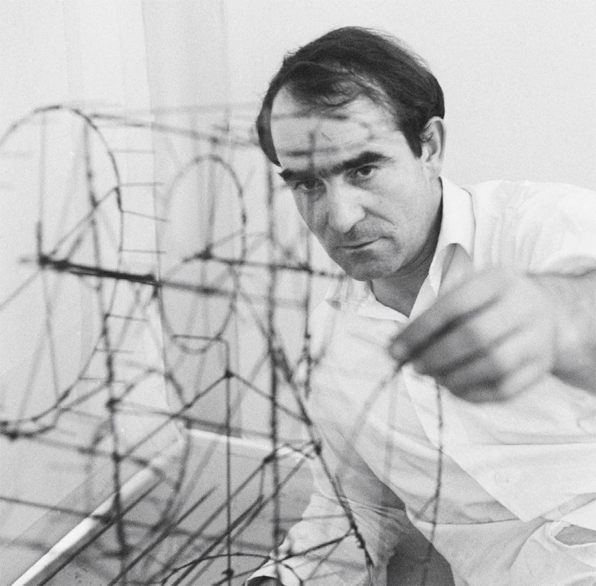

## Week 3 - Brief History of Kinetic Art
<!-- .slide: class=".uk-width-1-1 uk-height-large" -->  

Note:

---

#### <a href="https://en.wikipedia.org/wiki/Antikythera_mechanism">Antikythera mechanism</a>

</img>

Note:
This is described as the oldest known example of an analogue computer. It was used to predict astronomical positions and eclipses decades in advance.

An **analog signal** is any continuous-time signal representing some other quantity, i.e., analogous to another quantity. For example, in an analog audio signal, the instantaneous signal voltage varies continuously with the pressure of the sound waves.[1]

In contrast, a digital signal represents the original time-varying quantity as a sampled sequence of quantized values. Digital sampling imposes some bandwidth and dynamic range constraints on the representation and adds quantization error.[2]

The term analog signal usually refers to electrical signals; however, mechanical, pneumatic, hydraulic, and other systems may also convey or be considered analog signals. 

---

#### Mechanism

A mechanism is an assembly of moving parts.

In engineering, a mechanism is a device that transforms **input** forces and movement into a desired set of **output** forces and movement.

Note:
1540s, "structure of any kind," from Middle French machine "device, contrivance," from Latin machina "machine, engine, military machine; device, trick; instrument" (source also of Spanish maquina, Italian macchina), from Greek makhana, Doric variant of Attic mēkhanē "device, tool, machine;" also "contrivance, cunning," traditionally (Watkins) from PIE magh-ana- "that which enables," from root magh- "to be able, have power." But Beekes, on formal grounds, objects to the connection to words in Germanic and Slavic. He finds the Greek word isolated and is convinced that it is Pre-Greek.

Main modern sense of "device made of moving parts for applying mechanical power" (1670s) probably grew out of mid-17c. senses of "apparatus, appliance" and "military siege-tower."  It gradually came to be applied to an apparatus that works without the strength or skill of the workman.

---

#### Machine

A machine is any device that helps you do work, from a hammer to a bicycle. A hammer is a machine because it makes your arm longer, so you can do more work.

---

#### Four uses of Machines

- Transform energy
- Transfer energy
- Multiply and/or change direction of force
- Multiply speed

---

#### <a href="https://en.wikipedia.org/wiki/Orrery" width="500">Orrery</a>

</img>

---

#### The Origins of Animation

<iframe width="560" height="315" src="https://www.youtube.com/embed/fNxUXajnbnY?si=EXIYtzWdVwFpqL05" title="YouTube video player" frameborder="0" allow="accelerometer; autoplay; clipboard-write; encrypted-media; gyroscope; picture-in-picture; web-share" allowfullscreen></iframe>

---

#### Alexander Calder

<iframe width="560" height="315" src="https://www.youtube.com/embed/t6jwnu8Izy0?si=4WFGPgqoBiBdxBOT" title="YouTube video player" frameborder="0" allow="accelerometer; autoplay; clipboard-write; encrypted-media; gyroscope; picture-in-picture; web-share" allowfullscreen></iframe>

Note: 
Kinetic art derives from the Greek word “kinesis”, meaning “movement”.

The 1920’s through to the 1960s saw experiments with mobiles

As Calder put it, kinetic art was striving to “lift the figures and scenery off the page and prove undeniably that art is not rigid”. 

Kinetic artists utilised mechanical or natural motion to bring about a new relationship between art and technology, inspired heavily by the “Dada” art movement, breaking with conventions of traditional static artwork.

---

#### <a target="_blank" href="https://vimeo.com/225531185">Jean Tinguely</a>

</img>

---

#### Metamatics

Machines that produce artworks.

http://radicalart.info/process/vibration/metamatic/index.html

---

#### Sketching a Mechanism Idea

<embed type="text/html" src="https://www.are.na/yeseul-song/motor-mechanism-with-cardboard" width="100%" height="500px">

Note:
You can protect projects from costly overdesign with a basic knowledge of mechanics and materials.
