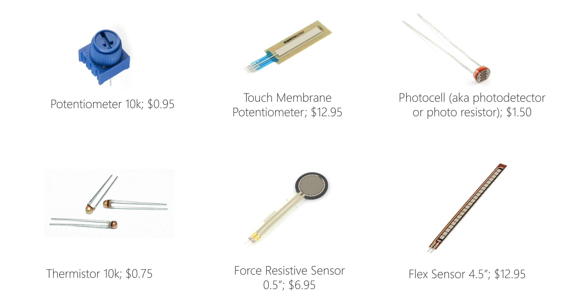

## Week 6 - Review and Warm Up
<!-- .slide: class=".uk-width-1-1 uk-height-large" -->  

Note:

---

### Arduino Warmup
#### Predict the Position
```C
#include <Servo.h>

Servo myservo;  // create servo object to control a servo

void setup() {
  myservo.attach(9);  // attaches the servo on pin 9 to the servo object
}

void loop() {
  myservo.write(90);  // tell servo to go to position in variable 'pos'
}
```

---

#### Connect a Potentiometer

```C
#include <Servo.h>

Servo myservo;  // create servo object to control a servo
int potpin = A0;  // analog pin used to connect the potentiometer
int val;    // variable to read the value from the analog pin

void setup() {
  myservo.attach(9);  // attaches the servo on pin 9 to the servo object
}

void loop() {
  // analogRead is a value between 0 - 1023
  val = analogRead(potpin);
  
  myservo.write(val);                  // sets the servo position according to the scaled value
  delay(15);                           // waits for the servo to get there
}
```

---

#### Other Variable Resistors

 </img>

---

#### map() function

```C
map(value, fromLow, fromHigh, toLow, toHigh);
```

---

### Scope

<embed type="text/html" src="https://www.arduino.cc/reference/en/language/variables/variable-scope-qualifiers/scope/" width="900px" height="600px">

---

### Functions and Scope

<pre>
<code>
int var1 = 0;

void setup() {
  Serial.begin(9600);
}

void loop() {
  int var2 = 5;
  add(var2);
  Serial.println(result);
  
  delay(3000);
}

int add(int par1) {
  return var1 + par1;
}
</code> <!-- .element: class="data-line-numbers" style="font-size: 15px" data-line-numbers="|1-3|4-6|9|10|11|13|16-18" -->
</pre>

---

### return 1 or 0; If statements

```C
int checkSensor() {
  if (analogRead(0) > 600) {
    return 1;
  }
  else {
    return 0;
  }
}
```

---

### Button Toggle

<pre>
<code>
#define LED_PIN 8
#define BUTTON_PIN 7

int lastButtonState = LOW;

void setup() {
  pinMode(LED_PIN, OUTPUT);
  pinMode(BUTTON_PIN, INPUT);
}

void loop() {
  int buttonState = digitalRead(BUTTON_PIN);
  
  if (buttonState != lastButtonState) {
    lastButtonState = buttonState;
    if (buttonState == LOW) {
      if(digitalRead(LED_PIN == HIGH)) {
        digitalWrite(LED_PIN, LOW);
      } else {
        digitalWrite(LED_PIN, HIGH);
      }
    }
  }
}
</code> <!-- .element: class="data-line-numbers" style="font-size: 15px" data-line-numbers="|1-3|5|7-10|13|15|16|17|18-22" -->
</pre>

---

### Arduino Examples

<ul>
<li>
Blink without Delay
</li>
<li>
Debounce
</li>
</ul>


