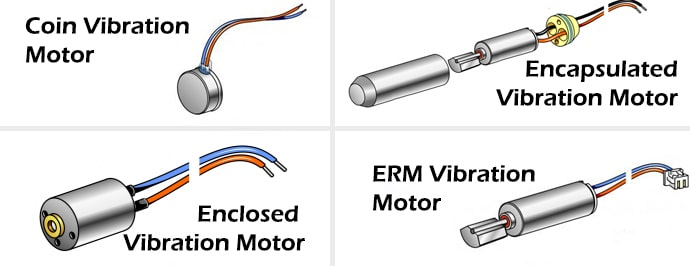
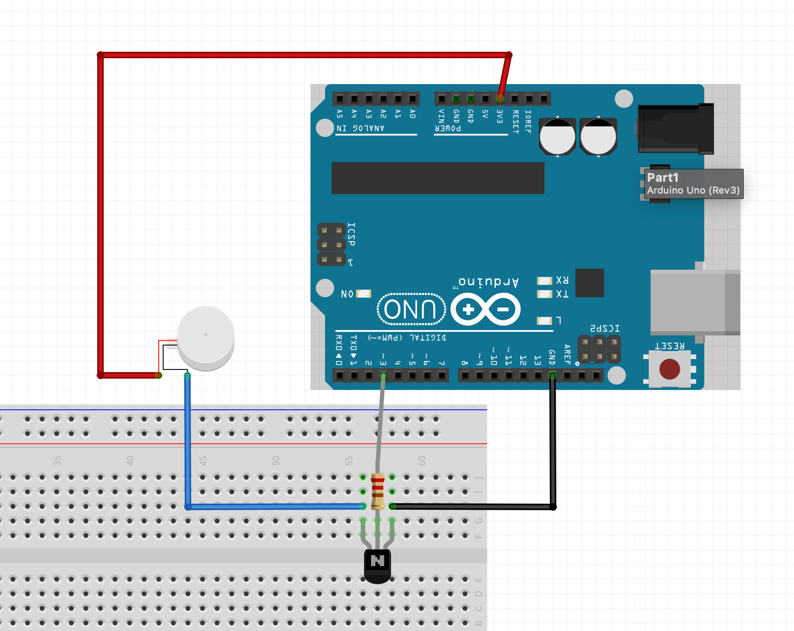
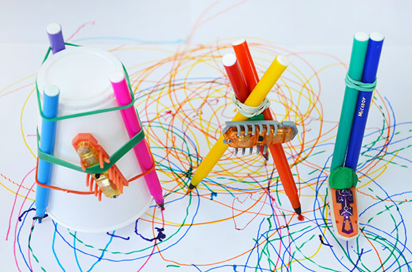

### <span style="color: blue">Week 2 Workshop</span>
<!-- .slide: class=".uk-width-1-1 uk-height-large" -->  

**Micro DC Motor / Vibration / Simple Arduino Sketches**

Note:

---

#### Example

<video width="300" controls>
    <source src="./images/example.mov" type="video/mp4">
</video>

---

#### Materials

<b>For Vibration</b>
- Motor  
  - <a target="_blank" href="https://www.aliexpress.us/item/2251832682681500.html?spm=a2g0o.order_list.order_list_main.11.23581802iSGv1Z&gatewayAdapt=glo2usa">Motor 1</a>
  - <a target="_blank" href="https://www.amazon.com/dp/B07KYLZC1S?psc=1&ref=ppx_yo2ov_dt_b_product_details">Motor 2</a>
- Coin Cell Battery
- Battery Holder / Electrical Tape
- Toggle Switch

<hr>

<b>For Body:</b>  
- <a href="https://www.amazon.com/gp/product/B07H7FCWDQ/ref=ppx_yo_dt_b_search_asin_title?ie=UTF8&psc=1">Copper Wire</a>
- Toothbrush Head

---

#### <a target="_blank" href="https://makeabilitylab.github.io/physcomp/advancedio/vibromotor.html">Vibromotors</a>

</img>

---

#### Simple Arduino "Blink" Example

<a href="./arduino/Blink/blink_breadboard.png"></img></a>

Note:
- How to make a simple circuit.
  - Needs 3 things: Energy source (battery), wires, output (motor)
- Battery polarity: Cathode (positive), and Anode (negative)

---

#### Arduino Code

```c
// A simple "blink example". Turns motor on and off.

int motorPin = 3; //motor transistor is connected to pin 3

void setup()
{
  pinMode(motorPin, OUTPUT);
}

void loop()
{
  digitalWrite(motorPin, HIGH); //vibrate
  delay(1000);  // delay one second
  digitalWrite(motorPin, LOW);  //stop vibrating
  delay(1000); //wait 50 seconds.
}
```

---

#### How to use Vibration

</img>
